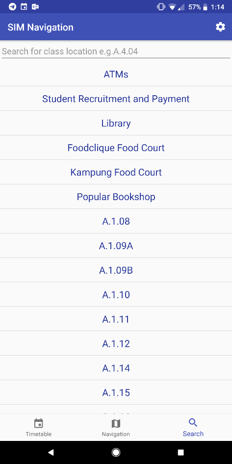
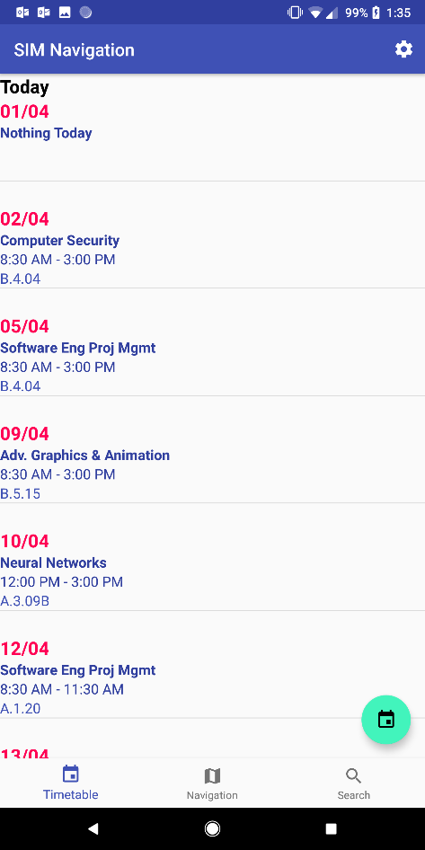
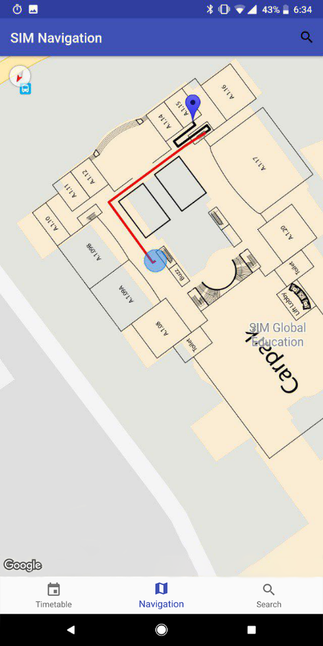
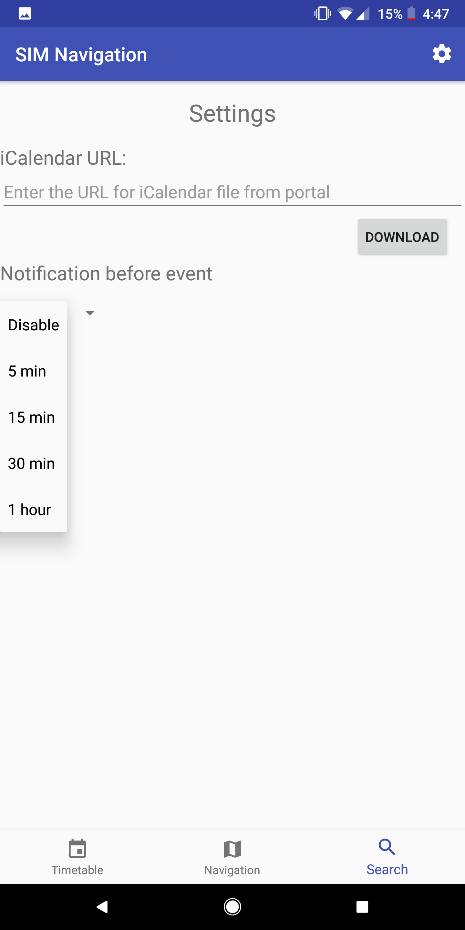
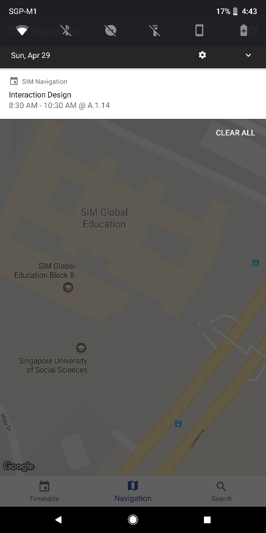

# sim-navigation-app

As part of a Final Year Project, this project seeks to help improve how students and staff navigate around Singapore Institute of Management (SIM) using their smartphones.

A prototype Android application was developed to assist and provide users with their current location and turn-by-turn navigation to their destination.

Bluetooth Beacons were also built and placed around the school which provided the application with the ability to pinpoint the location of the user.

# Functions

- Provide a way to access the class timetable so users know where to go
- Provide accurate positional location to users so that they know where their current location is
- Provide navigation that can help users find their way to their destination from their current location

## Screenshots

